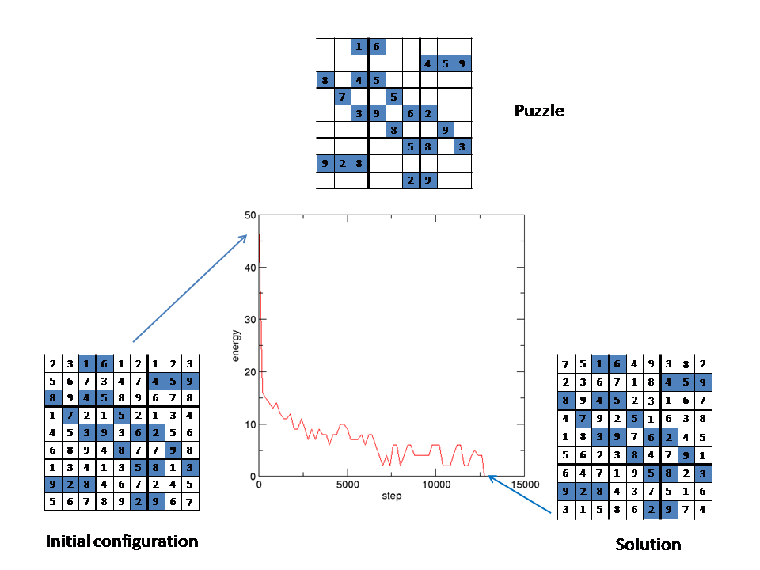

# Sudoku Optimization Solvers 

**Authors :** [Zeryab Moussaoui](https://fr.linkedin.com/in/zeryab-moussaoui-9a728029)

## Introduction

The aim of this project is to provide benchmarking environnement to solve Sudoku grid using Optimization Methods.
This is done my minimizing Grid Energy, which corresponds to number of free positions.

## Installation

* Download zip of github project and unzip it.

* Check the following requirements :
* Python > 3.6.3
* Scikit-learn > 0.19.1

## How to

1/ Edit the Sudoku Grid in the [sudoku.dat](./sudoku.dat) file.

Zeros corresponds to unknown values.

For example :

0 0 1 2  
0 0 0 0  
1 0 0 3  
0 3 0 0   

Or

0 0 1 6 0 0 0 0 0 
0 0 0 0 0 0 4 5 9 
8 0 4 5 0 0 0 0 0 
0 7 0 0 5 0 0 0 0 
0 0 3 9 0 6 2 0 0 
0 0 0 0 8 0 0 9 0 
0 0 0 0 0 5 8 0 3 
9 2 8 0 0 0 0 0 0 
0 0 0 0 0 2 9 0 0

2/ Choose one of the provided methods (or implement your !) :

| Method   |  Reference |  File to execute | 
| ------------- | ------------- | ------------- |
| Metropolis  | [Metr-53](https://bayes.wustl.edu/Manual/EquationOfState.pdf) | [sudoku_MC.py](./sudoku_MC.py)|
| Q-Learning  | [Watkins-89](https://www.researchgate.net/publication/33784417_Learning_From_Delayed_Rewards/) | [sudoku_QL.py](./sudoku_QL.py)|
| Q Neural Network  | [Tesauro-95](https://bkgm.com/articles/tesauro/tdl.html) | [sudoku_QNN.py](./sudoku_QNN.py)|

Execute the file, console shows results :

[[5 9 1 6 4 7 3 8 2] 
 [7 6 2 3 1 8 4 5 9] 
 [8 3 4 5 2 9 7 6 1] 
 [4 7 9 2 5 1 6 3 8] 
 [1 8 3 9 7 6 2 4 5] 
 [2 5 6 4 8 3 1 9 7] 
 [6 4 7 1 9 5 8 2 3] 
 [9 2 8 7 3 4 5 1 6] 
 [3 1 5 8 6 2 9 7 4]]

